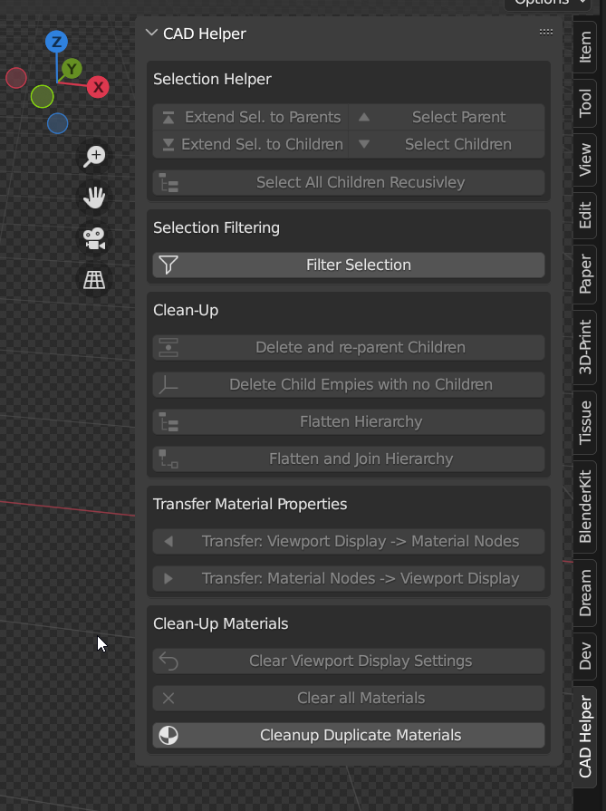

# Blender Addon: CAD Helper
Blender Addon for imported CAD assemblies.

## Functions:

In a hierarchical CAD model (with sub-assemblies and parts), select one or more of the objects. You can then:
* Recursivley select all of it's child elements
* Select parent or child objects (with or without extending the selection)
* Below the selected object(s); all leafes empties (empties without children) are deleted.
* **Filter selection**
    * Allows you to filter all the selected parts by bounding box. Lets you specifiy a min and max size in % relative to the selected parts.
    * Allows you to filter all the selected parts by object type (EMPTY, MESH, CURVE, etc.)
    * Allows you to filter all the selected parts by their name (simple string match & RegEx)
* Delete one or multiple objects in the hirarchy. All the children of the selected objects are automatically reconnected to their 'grand-parents' before they are deleted.
* Delete all (leaf) empties that don't have any (non-empty type) children
* Transfer material properties between Principled BSDF Node and View Port Display settings
This is sometimes required as some CAD export color, roughness & alpha to the View Port Display instead of the actual material node (i.e. BIM)

# Installation:

1. Download the *.zip file of the latest release onto your hard-drive: 
https://github.com/AchimA/CAD-Helper/releases/latest/download/CAD-Helper.zip
1. In Blender
    1. Got to Edit / Preferences / Add-ons
    1. Hit install and select the downloaded *.zip file
    1. Activate the addon by ticking the box
1. The add-on can then be accessed in the 3D view right side-bar (N-menu).