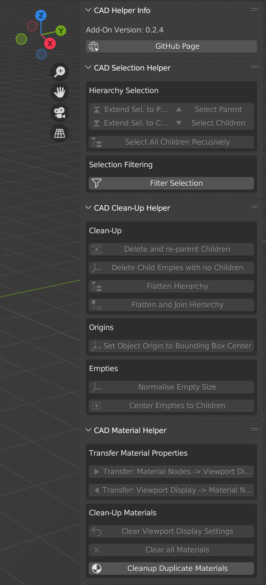

> **NOTE:** This "add-on" has now been ported to a modern Blender "extension". To install / update it, please use **Edit > Preferences > Get Extensions** and search for **CAD-Helper**.\
> https://extensions.blender.org/approval-queue/cad-helper/

#  Blender Extension: CAD Helper

Blender Extension for imported CAD assemblies.\

## Functions:
This extension aims to simplify the cleaning & restructuring of imported CAD assemblies. This is especially helpful for larger assemblies with hundreds of parts and many nested sub-assemblies.

Most operators work on selections (either one or multiple objects within the assembly structure).

Implemented operators are: 
* **Selection Helper**
    * Select parent or child objects (with or without extending the selection)
    * Recursively select all child elements of the current selection
* **Selection Filtering**
    * Filter the selection by their name (simple string match & RegEx)^.
    * Filter the selection by object type (EMPTY, MESH, CURVE, etc.)
    * Filter the selection by bounding box size.Lets you specify a min and max size in % relative to the selected parts.
    * Filter the selection by vertex count.
* **Clean-Up**
    * Delete one or multiple objects in the hierarchy. All the children of the selected objects are automatically reconnected to their 'grand-parents' before they are deleted.
    * Delete all leaf empties (empties without children) below the selected objects.
    * Flattens the hierarchy below any selected nodes.
    * Flattens the hierarchy below any selected nodes and joins all the mesh objects. All modifiers are applied before joining.
    * Set the object (part) origins relative to the part geometry
    * Resize all the selected empties, without resizing all of the children
    * Set the empty (assembly origin) position to the average of all the child objects.
* **Origins**
    * Sets the origin of mesh objects to their bounding box center.
* **Empties**
    * Normalize the size of the selected empties.
    * Place the empties at the center (median) of the location of its children.
* **Transfer Material Properties [❗Experimental]**
    * Transfer material properties between Principled BSDF Node and View Port Display settings.
    This is sometimes required as some CAD export color, roughness & alpha to the View Port Display instead of the actual material node (i.e. BIM).
* **Clean-Up Materials  [❗Experimental]**
    * Clear viewport colors. Resets all objects to standard gray, when viewed in solid shading
    * Clear all materials from selected objects
    * Remove duplicated materials.
    This compares base color, alpha, roughness and metallic in the BSDF node and replaces all materials with the same values.\
    :information_source: This operator works on the entire scene, not only selected objects.
* **Link / Object-Data Helper  [❗Experimental]**
    * Detect same-named object groups (e.g., exported duplicates like screws) and link their mesh data. This can greatly reduce the number of vertices.\
    ❗→ Since only the name is checked, it might have unwanted behaviour. Please be sure to check the outcome!
